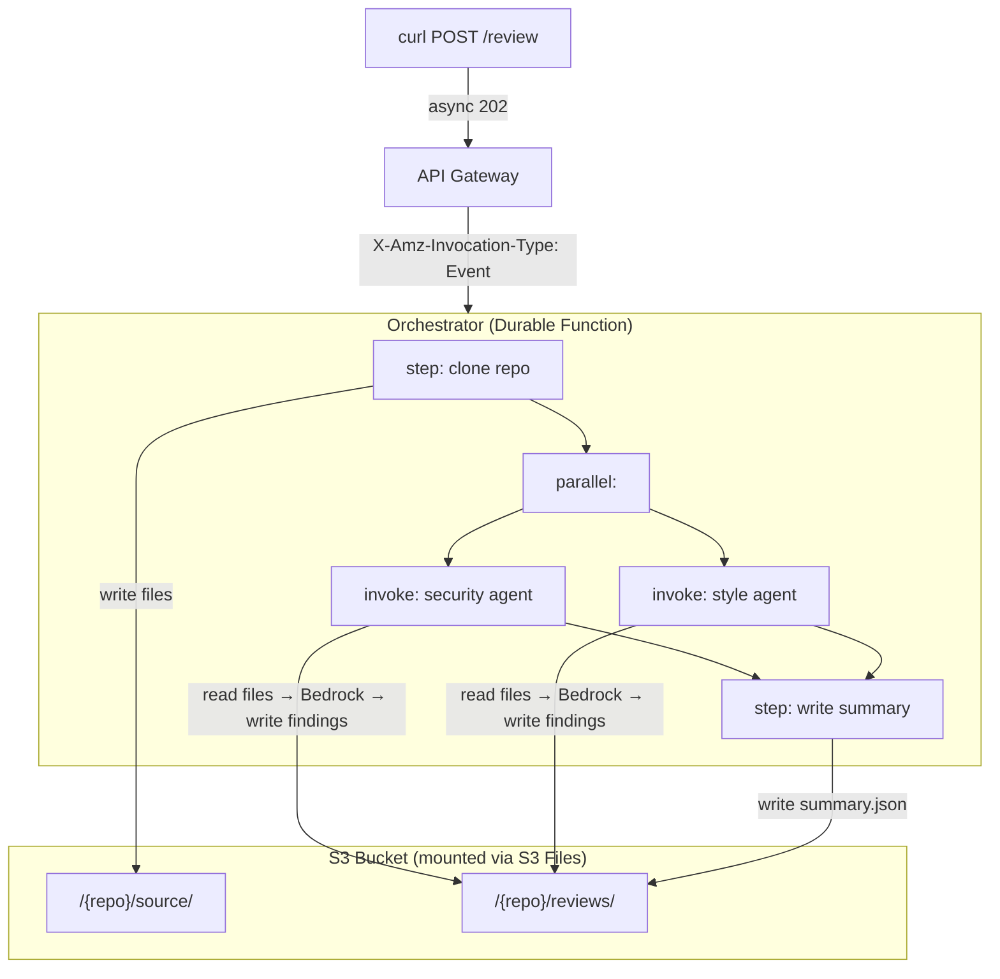

# Serverless Code Review Agents

AI-powered code review using **S3 Files**, **Durable Functions**, and **Strands Agents SDK**.

Point it at a public GitHub repo and two AI agents review your code concurrently. The orchestrator clones the repo to a shared S3 Files mount, then security and style agents analyze it in parallel using Bedrock.

## Architecture



## What this demonstrates

- **S3 Files**: Mount an S3 bucket as a local filesystem in Lambda.
  Agents read and write files with `open()` and `pathlib`. No boto3 for storage.
- **Durable Functions**: Orchestrate a multi-step workflow with automatic checkpointing.
  Clone first, then review in parallel. If interrupted, it resumes from the last checkpoint.
- **Strands Agents SDK**: Each review agent is a Strands agent with custom file tools
  backed by the S3 Files mount. The agent explores the codebase autonomously.

## Prerequisites

- **AWS CLI** configured with credentials that have permissions for Lambda, S3, VPC, IAM, API Gateway, and Bedrock
- **AWS SAM CLI** v1.153+ ([install guide](https://docs.aws.amazon.com/serverless-application-model/latest/developerguide/install-sam-cli.html))
- **Bedrock model access** enabled for Claude Sonnet 4 in your target region (cross-region inference profile `us.anthropic.claude-sonnet-4-20250514-v1:0`)
- **Python 3.13+** locally, or **Finch/Docker** for container builds (recommended)

## Setup

### 1. Clone the repo

```bash
git clone https://github.com/singledigit/lambda-s3-files-example.git
cd lambda-s3-files-example
```

### 2. Build

If your local Python matches 3.13, you can build directly:

```bash
sam build
```

Otherwise, use a container build (requires Finch or Docker):

```bash
sam build --use-container
```

### 3. Deploy

```bash
sam deploy --guided
```

The guided deploy will prompt you for:
- **Stack name**: e.g., `code-review-agents`
- **Region**: any region with Bedrock Claude Sonnet 4 access
- **Confirm changeset**: `Y`
- **Allow IAM role creation**: `Y`
- **Save to samconfig.toml**: `Y`

This creates a `samconfig.toml` so subsequent deploys just need `sam deploy`.

First deploy takes **10-15 minutes** (VPC, NAT gateway, and S3 Files mount targets take time to provision). Updates after that are much faster.

## Testing

### Start a review

The `ApiEndpoint` stack output has the full URL. Use it with curl:

```bash
curl -X POST <ApiEndpoint> \
  -H "Content-Type: application/json" \
  -d '{"repo_url": "https://github.com/singledigit/durable-serverlesspresso"}'
```

You'll get a `202 Accepted` response immediately. The review runs asynchronously in the background.

### Check results

Allow 2-3 minutes for the agents to clone the repo, analyze the code, and write findings. Then check the S3 bucket (the `WorkspaceBucketName` stack output):

```bash
# List review files
aws s3 ls s3://<WorkspaceBucketName>/lambda/durable-serverlesspresso/reviews/

# View the combined summary
aws s3 cp s3://<WorkspaceBucketName>/lambda/durable-serverlesspresso/reviews/summary.json - | python3 -m json.tool
```

You should see `security.json`, `style.json`, and `summary.json` with structured findings from both agents.

### Troubleshooting

- **No results after 5 minutes?** Check the orchestrator logs: `aws logs tail /aws/lambda/code-review-orchestrator --since 10m`
- **Bedrock access denied?** Make sure you've enabled Claude Sonnet 4 model access in the Bedrock console for your region
- **Mount permission errors?** The access point needs `CreationPermissions` with UID/GID 1000. See the IaC notes below.

## Cleanup

Remove all deployed resources:

```bash
sam delete
```

This deletes the entire CloudFormation stack including the VPC, S3 bucket, file system, and all Lambda functions. The S3 bucket must be empty for deletion to succeed. If it fails, empty the bucket first:

```bash
aws s3 rm s3://<WorkspaceBucketName> --recursive
sam delete
```

## Project structure

```
├── template.yaml                          # Main SAM template
├── src/
│   ├── orchestrator/app.py                # Durable function
│   ├── security_agent/app.py              # Strands security agent
│   └── style_agent/app.py                 # Strands style agent
├── stacks/
│   └── network.yaml                       # VPC nested stack
└── blog/                                  # Blog content (gitignored)
```

## IaC notes

S3 Files is brand new. A few things to know when writing CloudFormation:

- Resource types: `AWS::S3Files::FileSystem`, `AWS::S3Files::MountTarget`, `AWS::S3Files::AccessPoint`
- The S3 Files IAM role trusts `elasticfilesystem.amazonaws.com` (not `s3files`)
- Bucket must have versioning enabled
- Lambda `FileSystemConfigs.Arn` takes the **access point** ARN, not the file system ARN
- Access point needs `PosixUser` (UID/GID 1000:1000) and `RootDirectory` with `CreationPermissions`
- Lambda IAM uses `s3files:ClientMount`, `s3files:ClientWrite`, `s3files:ClientRootAccess`
- Mount targets take ~5 minutes to create
- cfn-lint doesn't recognize the S3Files resource types yet (false positive errors)

## License

MIT
