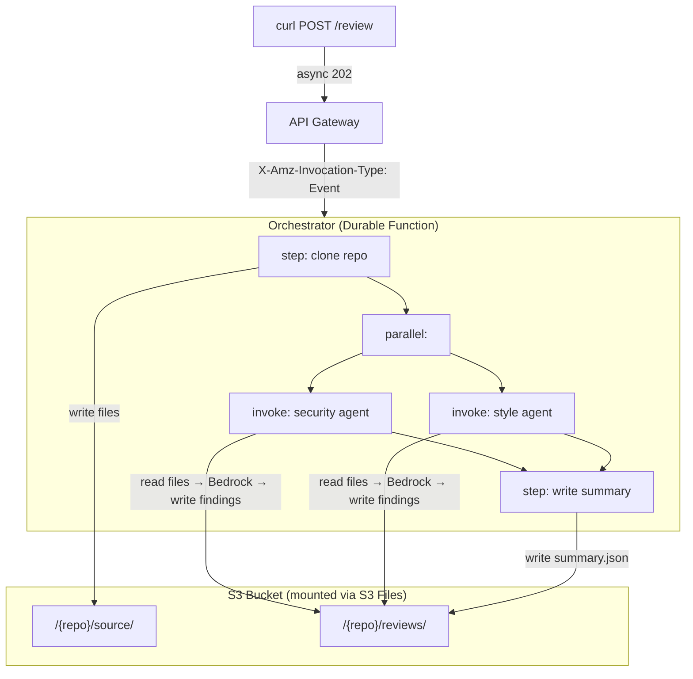

# Serverless Code Review Agents

AI-powered code review using **S3 Files**, **Durable Functions**, and **Strands Agents SDK**.

Point it at a public GitHub repo and two AI agents review your code concurrently. The orchestrator clones the repo to a shared S3 Files mount, then security and style agents analyze it in parallel using Bedrock.

## Architecture



## What this demonstrates

- **S3 Files**: Mount an S3 bucket as a local filesystem in Lambda.
  Agents read and write files with `open()` and `pathlib`. No boto3 for storage.
- **Durable Functions**: Orchestrate a multi-step workflow with automatic checkpointing.
  Clone first, then review in parallel. If interrupted, it resumes from the last checkpoint.
- **Strands Agents SDK**: Each review agent is a Strands agent with custom file tools
  backed by the S3 Files mount. The agent explores the codebase autonomously.

## Prerequisites

- AWS CLI configured with appropriate permissions
- AWS SAM CLI v1.153+
- Bedrock model access enabled for Claude Sonnet 4 (cross-region inference profile)
- Python 3.13 (container build handles this if you have a different local version)
- Finch or Docker (for container builds if local Python doesn't match)

## Deploy

```bash
sam build --use-container
sam deploy --guided
```

The first deploy creates a `samconfig.toml` with your settings. Subsequent deploys use it automatically.
Override as needed:

```bash
sam deploy --parameter-overrides "BedrockModelId=us.anthropic.claude-sonnet-4-20250514-v1:0"
```

First deploy takes ~10-15 minutes (VPC, NAT gateway, S3 Files mount targets).
Updates are much faster.

## Usage

```bash
# Start a review
curl -X POST https://<api-id>.execute-api.<region>.amazonaws.com/Prod/review \
  -H "Content-Type: application/json" \
  -d '{"repo_url": "https://github.com/owner/repo"}'

# Check results in the S3 bucket (allow 2-3 minutes for agents to finish)
aws s3 ls s3://<bucket-name>/lambda/<repo-name>/reviews/
aws s3 cp s3://<bucket-name>/lambda/<repo-name>/reviews/summary.json -
```

## Project structure

```
├── template.yaml                          # Main SAM template
├── samconfig.toml                         # Deploy defaults
├── src/
│   ├── orchestrator/app.py                # Durable function
│   ├── security_agent/app.py              # Strands security agent
│   └── style_agent/app.py                 # Strands style agent
├── stacks/
│   └── network.yaml                       # VPC nested stack
└── blog/                                  # Blog content (gitignored)
```

## IaC notes

S3 Files is brand new. A few things to know when writing CloudFormation:

- Resource types: `AWS::S3Files::FileSystem`, `AWS::S3Files::MountTarget`, `AWS::S3Files::AccessPoint`
- The S3 Files IAM role trusts `elasticfilesystem.amazonaws.com` (not `s3files`)
- Bucket must have versioning enabled
- Lambda `FileSystemConfigs.Arn` takes the **access point** ARN, not the file system ARN
- Access point needs `PosixUser` (UID/GID 1000:1000) and `RootDirectory` with `CreationPermissions`
- Lambda IAM uses `s3files:ClientMount`, `s3files:ClientWrite`, `s3files:ClientRootAccess`
- Mount targets take ~5 minutes to create
- cfn-lint doesn't recognize the S3Files resource types yet (false positive errors)

## Cleanup

```bash
sam delete
```
