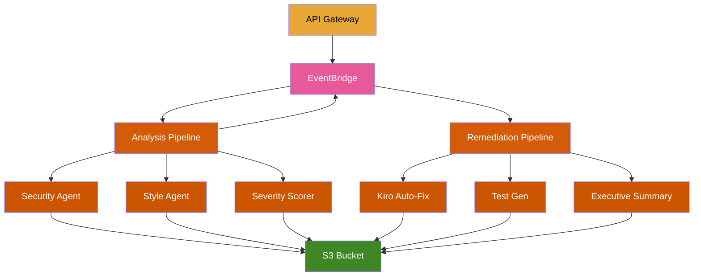

# Serverless Code Review Agents

AI-powered code review and auto-remediation using **S3 Files**, **Durable Functions**, **Strands Agents SDK**, and **EventBridge**.

This project expands on the demo from [S3 Files + Lambda Agents](https://edjgeek.com/blog/s3-files-lambda-agents/), which introduced the analysis pipeline. Here we add a full remediation tier — auto-fixing issues, generating validation tests, and producing an executive summary — all coordinated by EventBridge across two Durable Function pipelines.

Point it at a public GitHub repo and the pipeline analyzes your code, scores findings by severity, auto-fixes issues, generates validation tests, and produces an executive summary.

## Architecture



## What this demonstrates

- **S3 Files**: Mount an S3 bucket as a local filesystem in Lambda. All agents read and write files with `open()` and `pathlib` — no boto3 for storage.
- **Durable Functions**: Two durable orchestrators coordinate multi-step workflows with automatic checkpointing. If interrupted, they resume from the last completed step.
- **EventBridge**: API Gateway publishes events to the default bus. SAM implicit EventBridgeRule events wire the rules and permissions automatically. DF1 emits `analysis.complete` to trigger DF2.
- **Strands Agents SDK**: Each agent is a Strands agent with custom `@tool`-decorated functions backed by the S3 Files mount. Agents explore the codebase autonomously using Claude Sonnet 4 via Bedrock.

## Pipeline flow

| Step | Function | Duration (25-file repo) |
|------|----------|------------------------|
| Clone repo to S3 Files | Analysis Pipeline | ~1s |
| Security + Style review (parallel) | Security Agent, Style Agent | ~2.5 min |
| Severity scoring | Severity Scorer Agent | ~1 min |
| **DF1 total** | | **~3.5 min** |
| Kiro auto-fix | Kiro Auto-Fix Agent | ~5.8 min |
| Test generation | Test Gen Agent | ~8 min |
| Executive summary | Executive Summary Agent | ~33s |
| **DF2 total** | | **~14.3 min** |
| **End-to-end** | | **~18 min** |

## Output artifacts

All artifacts are written to the S3 Files mount at `/{repo}/reviews/`:

| File | Description |
|------|-------------|
| `security.json` | Security vulnerability findings |
| `style.json` | Code quality and style findings |
| `severity_scores.json` | CVSS-like scoring and prioritization |
| `analysis_summary.json` | Combined DF1 output |
| `fixes_applied.json` | What was auto-fixed and what was skipped |
| `test_generation.json` | Generated test metadata |
| `executive_summary.json` | Final fan-in report for leadership |
| `remediation_report.json` | Full DF2 output |

## Prerequisites

- **AWS CLI** configured with credentials for Lambda, S3, VPC, IAM, API Gateway, EventBridge, and Bedrock
- **AWS SAM CLI** v1.153+ ([install guide](https://docs.aws.amazon.com/serverless-application-model/latest/developerguide/install-sam-cli.html))
- **Bedrock model access** enabled for Claude Sonnet 4 in your target region
- **Python 3.14** (runtime)

## Setup

### 1. Clone the repo

```bash
git clone https://github.com/singledigit/lambda-s3-files-example.git
cd lambda-s3-files-example
```

### 2. Build

```bash
sam build
```

If you don't have Python 3.14 installed locally, use a container build (requires Docker or Finch). SAM needs a matching Python version to install dependencies with the correct native binaries for the Lambda runtime:

```bash
sam build --use-container
```

### 3. Deploy

```bash
sam deploy
```

The `samconfig.toml` is pre-configured with:
- Stack name: `code-review-agents`
- Region: `eu-central-1`
- Cached + parallel builds
- No changeset confirmation (deploys immediately)
- Disable rollback (for easier iteration)

First deploy takes **10-15 minutes** (VPC, NAT gateway, and S3 Files mount targets take time to provision).

### 4. Update the Bedrock model ID

The default model ID is `eu.anthropic.claude-sonnet-4-20250514-v1:0`. If deploying to a different region, update the `BedrockModelId` parameter:

```bash
sam deploy --parameter-overrides BedrockModelId=us.anthropic.claude-sonnet-4-20250514-v1:0
```

## Testing

### Start a review

```bash
curl -X POST <ApiEndpoint> \
  -H "Content-Type: application/json" \
  -d '{"repo_url": "https://github.com/singledigit/event-driven-agents"}'
```

You'll get a `202 Accepted` response immediately. The full pipeline runs asynchronously (~18 min for a 25-file repo).

### Check results

```bash
# List review artifacts
aws s3 ls s3://<WorkspaceBucketName>/lambda/event-driven-agents/reviews/

# View the executive summary
aws s3 cp s3://<WorkspaceBucketName>/lambda/event-driven-agents/reviews/executive_summary.json - | python3 -m json.tool

# View security findings
aws s3 cp s3://<WorkspaceBucketName>/lambda/event-driven-agents/reviews/security.json - | python3 -m json.tool

# View what was auto-fixed
aws s3 cp s3://<WorkspaceBucketName>/lambda/event-driven-agents/reviews/fixes_applied.json - | python3 -m json.tool
```

### Monitor execution

```bash
# DF1 progress
aws logs tail /aws/lambda/code-review-analysis-pipeline --since 5m --format short | grep DF1

# DF2 progress
aws logs tail /aws/lambda/code-review-remediation-pipeline --since 15m --format short | grep DF2

# Individual agent logs
aws logs tail /aws/lambda/code-review-security-agent --since 5m --format short
aws logs tail /aws/lambda/code-review-kiro-autofix --since 10m --format short
```

### Troubleshooting

- **No results after 20 minutes?** Check DF1 logs first — if clone fails, nothing else runs.
- **Bedrock access denied?** Enable Claude Sonnet 4 model access in the Bedrock console for your region. Use the correct regional prefix (`eu.`, `us.`, etc.).
- **"not enough values to unpack"?** The parallel invocations haven't returned yet. The durable function will retry automatically — this is normal replay behavior.
- **Mount permission errors?** The access point needs `CreationPermissions` with UID/GID 1000.

## Project structure

```
├── template.yaml                          # Main SAM template
├── samconfig.toml                         # Build + deploy config
├── src/
│   ├── analysis_pipeline/app.py           # DF1 — clone, parallel review, severity score
│   ├── remediation_pipeline/app.py        # DF2 — auto-fix, test gen, summary
│   ├── security_agent/app.py             # Strands agent — vulnerability scanning
│   ├── style_agent/app.py               # Strands agent — code quality review
│   ├── severity_scorer_agent/app.py     # Strands agent — CVSS-like scoring
│   ├── kiro_autofix_agent/app.py        # Strands agent — auto-fix (Kiro headless)
│   ├── test_gen_agent/app.py            # Strands agent — test generation
│   └── executive_summary_agent/app.py   # Strands agent — fan-in summary
├── stacks/
│   └── network.yaml                      # VPC nested stack (private subnets + NAT)
```

## Key design decisions

- **EventBridge over direct invocation**: API Gateway publishes to EventBridge rather than invoking Lambda directly. Both pipelines are triggered the same way (via events), making the architecture extensible.
- **Default bus with SAM implicit events**: No custom bus or explicit rules/roles. SAM handles the EventBridge rule creation and Lambda permissions automatically.
- **Durable Functions for intra-pipeline coordination**: Steps, parallel invocations, and checkpointing handle the complexity of multi-agent orchestration. The SDK's replay model ensures exactly-once semantics.
- **S3 Files as shared workspace**: All 8 functions mount the same access point. Agents share files without S3 API calls or passing large payloads between functions.
- **No git push**: The remediation pipeline writes fixes to the S3 Files mount but does not push back to the source repo. Results stay in S3 for consumers to pull.

## IaC notes

- Resource types: `AWS::S3Files::FileSystem`, `AWS::S3Files::MountTarget`, `AWS::S3Files::AccessPoint`
- The S3 Files IAM role trusts `elasticfilesystem.amazonaws.com` (not `s3files`)
- Bucket must have versioning enabled
- Lambda `FileSystemConfigs.Arn` takes the **access point** ARN, not the file system ARN
- Access point needs `PosixUser` (UID/GID 1000:1000) and `RootDirectory` with `CreationPermissions`
- Lambda IAM uses `s3files:ClientMount`, `s3files:ClientWrite`, `s3files:ClientRootAccess`
- Mount targets take ~5 minutes to create
- cfn-lint doesn't recognize the S3Files resource types yet (false positive errors)
- Durable functions require `AutoPublishAlias` for qualified ARN invocation

## Cleanup

```bash
# Empty the bucket first (required for deletion)
aws s3 rm s3://<WorkspaceBucketName> --recursive

# Delete the stack
sam delete
```

## License

MIT
